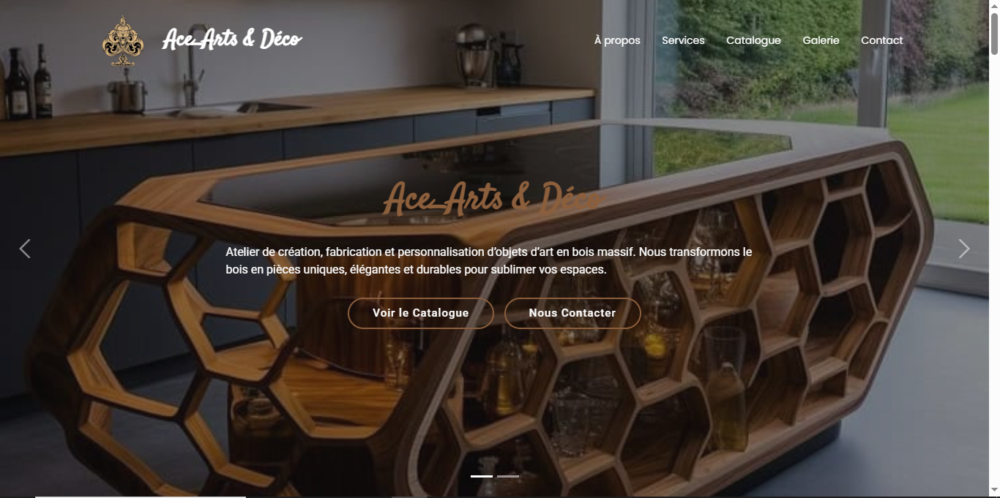
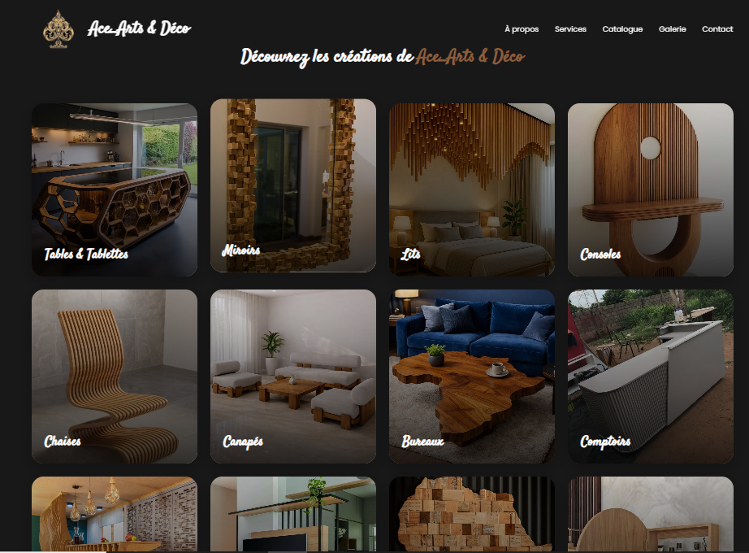
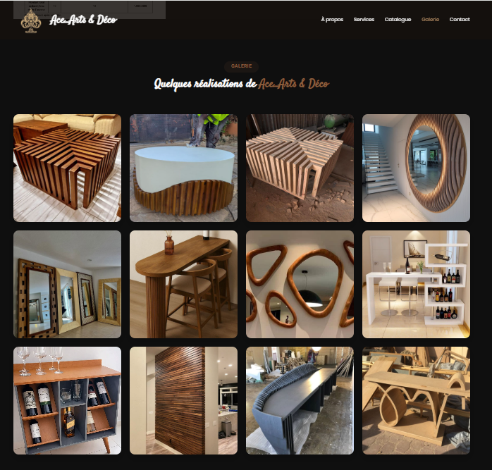
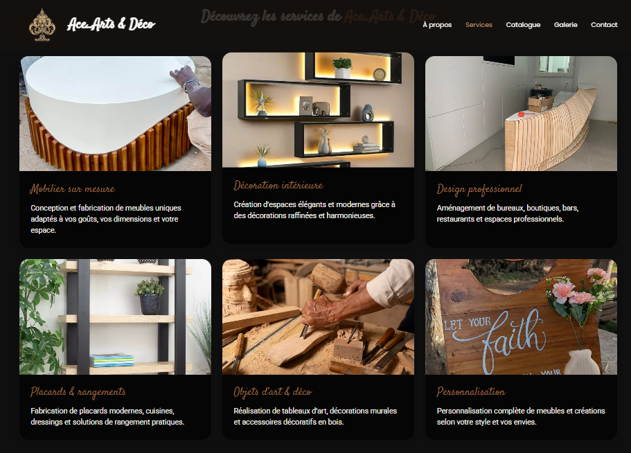
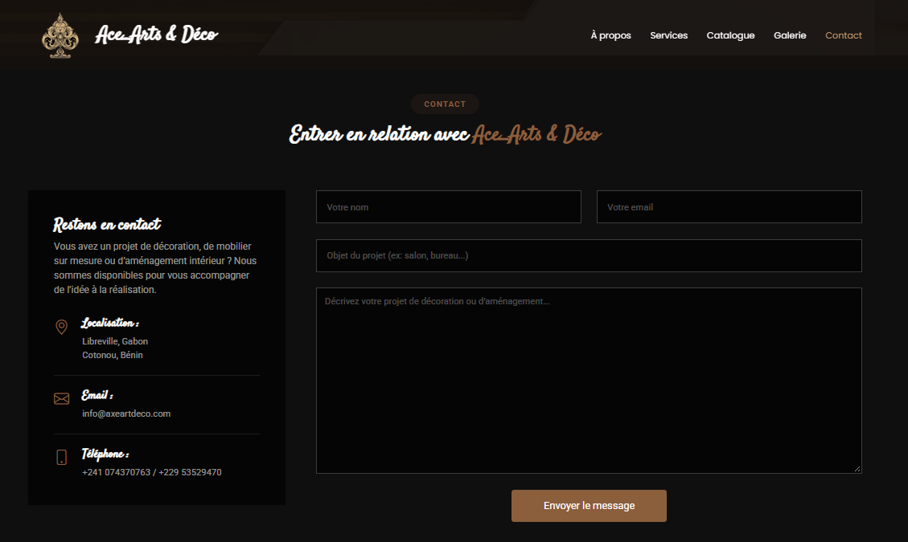
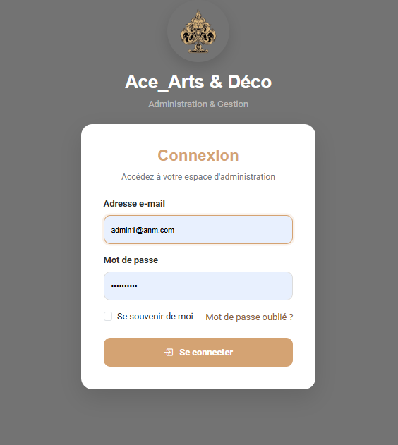

# Ace_Arts & Déco

> Plateforme web de présentation et de gestion d'un catalogue de créations artisanales en bois massif.


---

## 📌 Présentation

**Ace_Arts & Déco** est un atelier spécialisé dans la création, la fabrication et la personnalisation d'objets d'art, de meubles et de décorations en bois massif.

Présent au **Bénin et au Gabon**, l'atelier propose des réalisations destinées aussi bien aux particuliers qu'aux entreprises, boutiques, restaurants et espaces professionnels.

Le site web a été conçu pour présenter l'univers de la marque, mettre en valeur ses créations et faciliter la gestion de son catalogue.

---

## 🎯 Objectifs du projet

Le projet répond à plusieurs besoins :

* présenter l'activité et le savoir-faire de l'atelier ;
* mettre en valeur les réalisations ;
* organiser les créations dans un catalogue accessible en ligne ;
* présenter les différents services proposés ;
* permettre aux visiteurs de découvrir les créations par catégorie ;
* faciliter la prise de contact ;
* permettre à l'administrateur de gérer et d'enrichir le catalogue.

---

## 🪵 L'atelier

Ace_Arts & Déco conçoit des réalisations combinant **esthétique, qualité et durabilité**, avec une attention particulière portée aux finitions et à la personnalisation.

L'atelier réalise notamment :

* des meubles modernes et fonctionnels ;
* des éléments de décoration intérieure ;
* des objets d'art ;
* des projets sur mesure ;
* des aménagements destinés aux espaces professionnels.

Chaque projet peut être adapté aux besoins, aux dimensions et à l'environnement du client.

---

## 🛠️ Services

Le site présente les différents services proposés par Ace_Arts & Déco :

* **Mobilier sur mesure**
* **Décoration intérieure**
* **Design professionnel**
* **Placards & rangements**
* **Objets d'art & déco**
* **Personnalisation**

Ces services s'adressent aussi bien aux particuliers qu'aux entreprises et aux professionnels.

---

## 🛍️ Catalogue

Le catalogue permet de présenter les différentes créations de l'atelier à travers plusieurs catégories :

* Tables & Tablettes
* Miroirs
* Lits
* Consoles
* Chaises & Canapés
* Bureaux & Comptoirs
* Bar
* Design intérieur
* Tableaux d'art
* Placards
* Ustensiles cuisine
* Personnalisation

Le catalogue peut être enrichi depuis l'espace d'administration.

---

## ⚙️ Fonctionnalités

### 🌐 Partie publique

Les visiteurs peuvent :

* découvrir Ace_Arts & Déco ;
* consulter les services proposés ;
* parcourir le catalogue ;
* découvrir les différentes catégories de créations ;
* consulter les réalisations présentées ;
* contacter l'atelier via la section dédiée.

### 🔐 Administration

Une interface d'administration protégée par authentification permet de gérer le catalogue.

L'administrateur peut notamment :

* accéder à l'espace d'administration ;
* ajouter de nouvelles créations ;
* enrichir progressivement le catalogue ;
* gérer les contenus associés aux créations.

---

## 🖼️ Captures d'écran

Les principales interfaces du projet sont présentées ci-dessous.

### 🏠 Accueil

> Page d'accueil présentant l'univers d'Ace_Arts & Déco, ses activités et ses principales réalisations.



### 🛍️ Catalogue

> Présentation des créations disponibles dans le catalogue.



### 🪵 Créations

> Présentation des réalisations de l'atelier.



### 🛠️ Services

> Présentation des différents services proposés par l'atelier.



### 📩 Contact

> Interface permettant aux visiteurs de prendre contact avec l'atelier.



### 🔐 Administration

> Interface sécurisée permettant à l'administrateur de gérer le catalogue.




---

## 🏗️ Architecture

L'application repose sur l'architecture **MVC (Model-View-Controller)** proposée par Laravel.

```text
Ace_Arts & Déco
│
├── app/
│   ├── Models/
│   ├── Http/
│   │   ├── Controllers/
│   │   └── Requests/
│   └── ...
│
├── database/
│   ├── migrations/
│   └── seeders/
│
├── resources/
│   ├── views/
│   ├── css/
│   └── js/
│
├── routes/
│   └── web.php
│
├── public/
├── storage/
├── tests/
├── composer.json
└── README.md
```

---

## 🛠️ Technologies utilisées

### Backend

* **PHP 8.2**
* **Laravel 12**

### Base de données

* **MySQL**

### Frontend

* **HTML5**
* **CSS3**
* **JavaScript**
* **Blade**

### Outils

* **Composer**
* **NPM**
* **Vite**
* **Git**
* **GitHub**

---

## 🚀 Installation

### Prérequis

Avant d'installer le projet, assurez-vous d'avoir :

* PHP >= 8.2
* Composer
* MySQL
* Node.js et npm
* Git

### 1. Cloner le dépôt

```bash
git clone https://github.com/Ziyade001/Ace-Arts-Deco.git
```

### 2. Accéder au projet

```bash
cd Ace-Arts-Deco
```

### 3. Installer les dépendances PHP

```bash
composer install
```

### 4. Installer les dépendances JavaScript

```bash
npm install
```

### 5. Configurer l'environnement

Copier le fichier `.env.example` :

```bash
cp .env.example .env
```

Sous Windows PowerShell :

```powershell
Copy-Item .env.example .env
```

### 6. Générer la clé de l'application

```bash
php artisan key:generate
```

### 7. Configurer la base de données

Créer une base de données MySQL puis renseigner les informations correspondantes dans le fichier `.env`.

Exemple :

```env
DB_DATABASE=ace_arts
DB_USERNAME=root
DB_PASSWORD=
```

### 8. Exécuter les migrations

```bash
php artisan migrate
```

Si le projet contient des seeders :

```bash
php artisan db:seed
```

### 9. Compiler les ressources

Pour la production :

```bash
npm run build
```

Pour le développement :

```bash
npm run dev
```

### 10. Lancer l'application

```bash
php artisan serve
```

L'application sera alors accessible localement à :

```text
http://127.0.0.1:8000
```

---

## 🔒 Sécurité

L'espace d'administration est protégé par authentification afin de limiter l'accès aux fonctionnalités de gestion du catalogue.

Les informations sensibles de configuration ne sont pas versionnées dans le dépôt. Le fichier `.env` est exclu du contrôle de version et seul le fichier `.env.example` est fourni comme modèle de configuration.

---

## 📈 Résultats

Le projet permet à Ace_Arts & Déco de disposer d'une présence web structurée pour :

* présenter son activité ;
* valoriser ses réalisations ;
* organiser son catalogue ;
* présenter ses services ;
* faciliter le contact avec les visiteurs ;
* gérer l'ajout de nouvelles créations depuis un espace d'administration.

---

## 🔮 Évolutions possibles

Le projet peut évoluer avec l'ajout de nouvelles fonctionnalités, notamment :

* gestion complète des créations depuis l'administration ;
* modification et suppression des créations ;
* recherche et filtrage avancés ;
* galerie photo améliorée ;
* gestion des demandes de devis ;
* intégration des réseaux sociaux ;
* optimisation SEO ;
* statistiques de consultation ;
* système de gestion des demandes clients.

---

## 👨‍💻 Développement

**Ace_Arts & Déco** a été développé dans le cadre d'un projet web visant à mettre en pratique la conception et le développement d'une application Laravel répondant à un besoin concret d'entreprise.

### Développeur

**Ziyade AMINOU**

**Développeur Full Stack | Web • No-Code • Automatisation**

Technologies principales :

`PHP` · `Laravel` · `JavaScript` · `MySQL` · `WordPress`

---

## 📄 Licence

Ce projet est présenté à titre de **portfolio professionnel**.

Le contenu, les éléments graphiques, les images et l'identité visuelle associés à Ace_Arts & Déco restent la propriété de leurs détenteurs respectifs.
